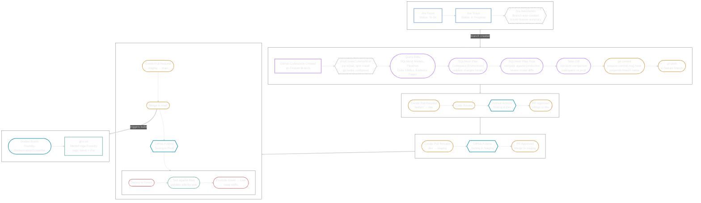

# MetricForge Foundry — CI/CD Systems Flow

```mermaid
%%{init: {'theme': 'dark', 'themeVariables': {'mainBkg': 'transparent', 'nodeBorder': '#555', 'clusterBkg': 'transparent', 'clusterBorder': '#555'}}}%%
flowchart TB
    classDef pm fill:none,color:#e0e0e0,stroke:#6ba3d6,stroke-width:2.5px
    classDef git fill:none,color:#e0e0e0,stroke:#d4a24e,stroke-width:2.5px
    classDef dev fill:none,color:#e0e0e0,stroke:#c084fc,stroke-width:2.5px
    classDef test fill:none,color:#e0e0e0,stroke:#6db89e,stroke-width:2.5px
    classDef deploy fill:none,color:#e0e0e0,stroke:#d4797a,stroke-width:2.5px
    classDef action fill:none,color:#e0e0e0,stroke:#0891b2,stroke-width:2.5px
    classDef auto fill:none,color:#e0e0e0,stroke:#888,stroke-width:2px,stroke-dasharray: 5 3

    subgraph PLAN ["1. Planning"]
        JIRA_TODO["Jira Ticket<br/>Status: To Do"]:::pm
        JIRA_IP["Jira Ticket<br/>Status: In Progress"]:::pm
        JIRA_AUTO{{"Jira Automation<br/>Branch auto-created<br/>ticket#-feature-summary"}}:::auto
        JIRA_TODO --> JIRA_IP --> JIRA_AUTO
    end

    subgraph DEV_ENV ["2. Development Environment"]
        CS["GitHub Codespace Created<br/>on Feature Branch"]:::dev
        POST{{"postCreateCommand.sh<br/>pip install, npm install<br/>git hooks configured"}}:::auto
        EDITS(["Query Edits<br/>SQLMesh Models, Pipelines<br/>Cube YAMLs, Evidence Pages"]):::dev
        PLAN_CS(["SQLMesh Plan<br/>Codespace Environment<br/>validate changes locally"]):::dev
        PLAN_PROD(["SQLMesh Plan Prod<br/>compare against production<br/>review model diffs"]):::dev
        TABLE_DIFF(["Table Diff<br/>row-level comparison<br/>codespace vs prod"]):::dev
        COMMIT(["git commit<br/>prepare-commit-msg hook<br/>prepends branch name"]):::git
        PUSH(["git push<br/>to feature branch"]):::git
        CS --> POST --> EDITS --> PLAN_CS --> PLAN_PROD --> TABLE_DIFF --> COMMIT --> PUSH
    end

    subgraph DEV_BRANCH ["3. Dev Branch"]
        PR_DEV(["Create Pull Request<br/>feature → dev"]):::git
        REVIEW_DEV(["Code Review"]):::git
        ACTION_DEV{{"GitHub Actions<br/>Testing in Dev"}}:::action
        MERGE_DEV(["PR Approved<br/>Merge to dev"]):::git
        PR_DEV --> REVIEW_DEV --> ACTION_DEV --> MERGE_DEV
    end

    subgraph STAGING ["4. Staging Branch"]
        PR_STAGE(["Create Pull Request<br/>dev → staging"]):::git
        ACTION_STAGE{{"GitHub Actions<br/>Testing in Staging"}}:::action
        APPROVE_STAGE(["PR Approved<br/>Merge to staging"]):::git
        PR_STAGE --> ACTION_STAGE --> APPROVE_STAGE
    end

    subgraph RELEASE ["5. Release to Production"]
        PR_MAIN(["Create Pull Request<br/>staging → main"]):::git
        MERGE_MAIN(["Merge to main"]):::git
        ACTION_PROD{{"GitHub Actions<br/>Testing in Prod"}}:::action
        PR_MAIN --> MERGE_MAIN --> ACTION_PROD

        subgraph BLUE_GREEN ["Blue / Green Deployment"]
            GREEN(["Deploy to Green"]):::deploy
            TEST_BLUE(["Test against Blue<br/>validate side-by-side"]):::test
            PROMOTE(["Promote Green → Live<br/>swap traffic"]):::deploy
            GREEN --> TEST_BLUE --> PROMOTE
        end

        ACTION_PROD --> BLUE_GREEN
    end

    subgraph BUILD_IMAGE ["6. Container Image Build"]
        BUILDX(["Docker Buildx<br/>Foundry-Orchestration/Dockerfile"]):::action
        GHCR["ghcr.io/<br/>MetricForge-Foundry<br/>tags: latest + sha"]:::test
        BUILDX --> GHCR
    end

    PLAN ==>|"branch created"| DEV_ENV
    DEV_ENV ==> DEV_BRANCH
    DEV_BRANCH ==> STAGING
    STAGING ==> RELEASE
    MERGE_MAIN ==>|"triggers build"| BUILD_IMAGE
```
