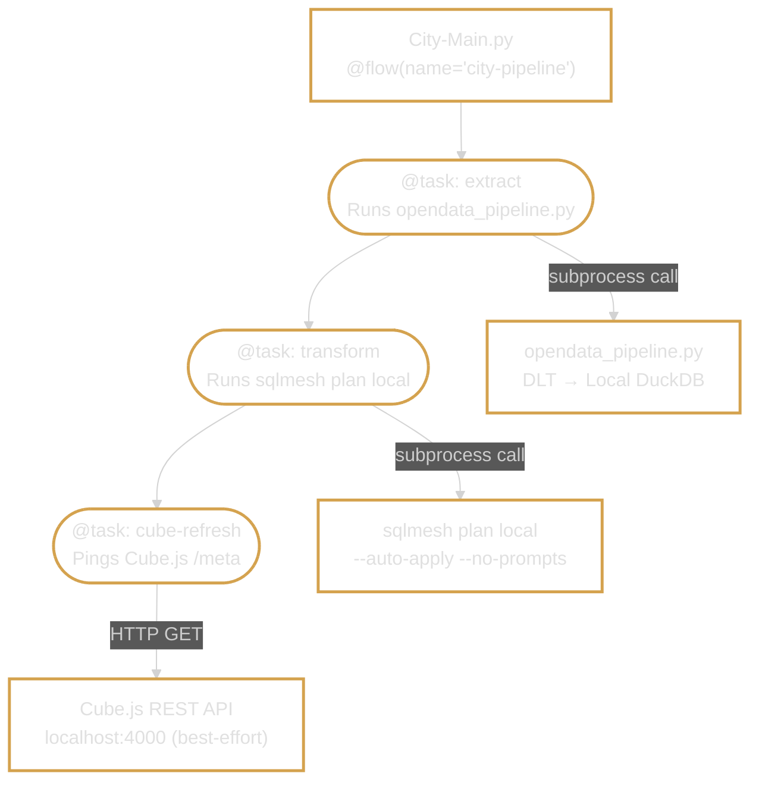
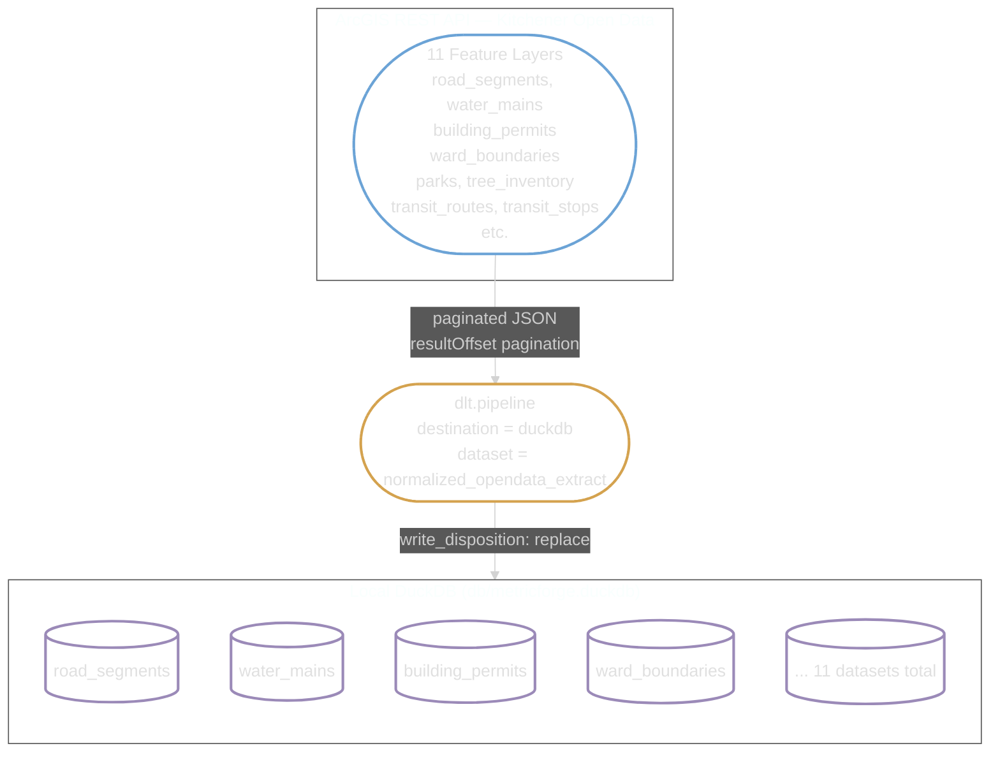
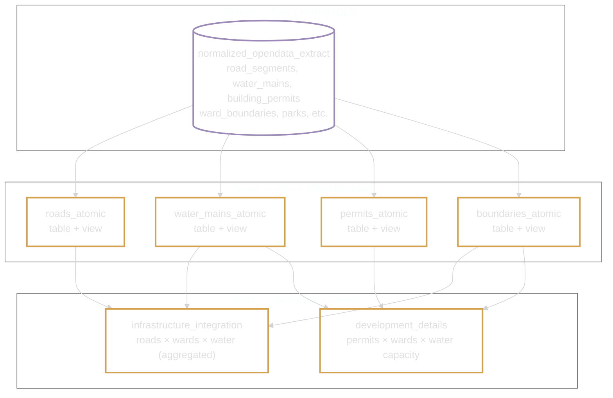
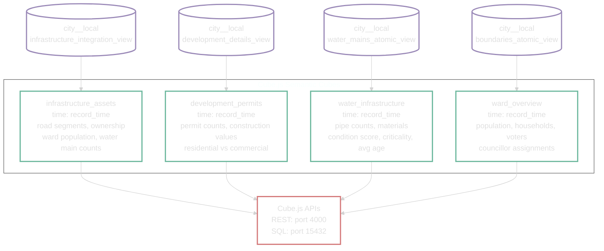
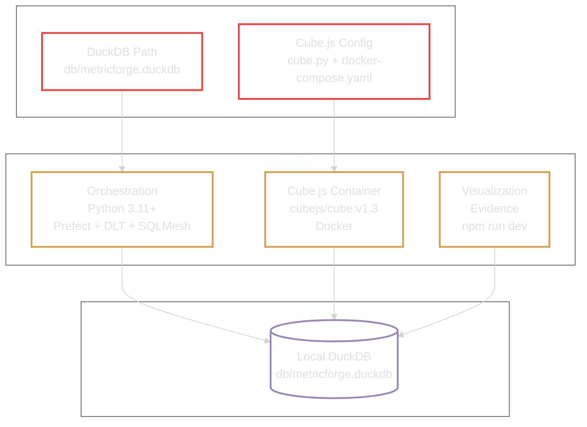
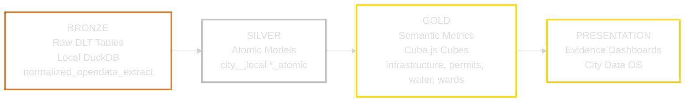
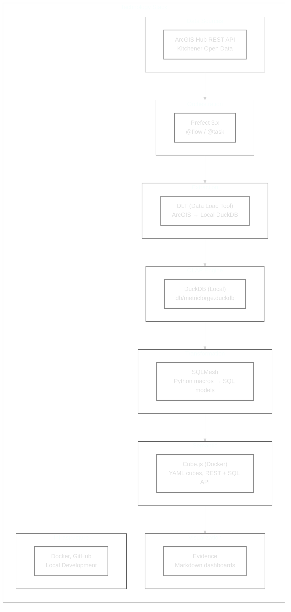

# MetricForge City Foundation — System Architecture

## High-Level Overview

```mermaid
%%{init: {'theme': 'dark', 'themeVariables': {'mainBkg': 'transparent', 'nodeBorder': '#555', 'clusterBkg': 'transparent', 'clusterBorder': '#555'}}}%%
flowchart LR
    classDef input fill:none,color:#e0e0e0,stroke:#6ba3d6,stroke-width:2.5px
    classDef process fill:none,color:#e0e0e0,stroke:#d4a24e,stroke-width:2.5px
    classDef data fill:none,color:#e0e0e0,stroke:#6db89e,stroke-width:2.5px
    classDef config fill:none,color:#e0e0e0,stroke:#d4797a,stroke-width:2.5px
    classDef db fill:none,color:#e0e0e0,stroke:#9b8ab8,stroke-width:2.5px
    classDef portal fill:none,color:#e0e0e0,stroke:#c084fc,stroke-width:2.5px

    subgraph SOURCES ["Municipal Data Sources"]
        direction TB
        S1[/"ArcGIS Open Data<br/>Kitchener Hub"/]:::input
        S2[/"Engineering Dept<br/>Roads, Bridges, Sewers"/]:::input
        S3[/"Planning Dept<br/>Permits, Zoning"/]:::input
        S4[/"Utilities<br/>Water, Sanitary, Storm"/]:::input
        S5[/"Transit (GRT)<br/>Routes, Stops"/]:::input
        S6[/"Parks & Rec<br/>Parks, Trees"/]:::input
    end

    subgraph PIPELINE ["City Data Pipeline"]
        direction TB
        subgraph EXTRACT ["Extract (DLT)"]
            DLT(["opendata_pipeline.py<br/>ArcGIS REST API → Local DuckDB"]):::process
        end
        subgraph TRANSFORM ["Transform (SQLMesh)"]
            direction TB
            ATOMIC(["Atomic Models<br/>roads, water_mains, permits, boundaries"]):::process
            INTEG(["Integration Models<br/>infrastructure_integration<br/>development_details"]):::process
            ATOMIC --> INTEG
        end
        subgraph SEMANTIC ["Semantic (Cube.js)"]
            direction TB
            C1["infrastructure_assets"]:::data
            C2["development_permits"]:::data
            C3["water_infrastructure"]:::data
            C4["ward_overview"]:::data
        end
        DLT --> ATOMIC
        INTEG --> C1
        INTEG --> C2
        INTEG --> C3
        INTEG --> C4
    end

    subgraph VIZ ["Visualization (Evidence)"]
        direction TB
        D1["City Data OS<br/>Overview Dashboard"]:::portal
        D2["Infrastructure Assets"]:::portal
        D3["Development & Housing"]:::portal
        D4["Water Systems"]:::portal
        D5["Data Governance"]:::portal
    end

    SOURCES --> DLT
    C1 --> D1
    C1 --> D2
    C2 --> D1
    C2 --> D3
    C3 --> D4
    C4 --> D1
```



---

## Step-by-Step Pipeline Details

### Step 1 — Orchestration (Prefect)



The orchestrator (`City-Main.py`) is parameterised by `--theme` and `--site`, defaulting to `Infrastructure` / `OpenData-Kitchener`. This enables adding new municipal pipelines (e.g. `PublicHealth` / `Region-Waterloo`) without modifying orchestration code. The third task (`cube-refresh`) is best-effort — if Cube.js is not running, the pipeline still completes successfully.

### Step 2 — Extraction (DLT)



The `arcgis_source.py` module provides a `DATASET_CATALOG` dictionary mapping friendly names to ArcGIS Feature Server URLs (org: `qAo1OsXi67t7XgmS`). Adding a new dataset is a single dictionary entry — the pagination, schema inference, and loading are handled by DLT automatically. Data lands in the `normalized_opendata_extract` schema within the local DuckDB file.

### Step 3 — Transformation (SQLMesh)



**Model pattern:** Each atomic model uses a Python macro that generates SQL. Models come in table + view pairs:
- **Table** (`INCREMENTAL_BY_TIME_RANGE`): Efficient for large datasets with time-based partitioning.
- **View**: Always-fresh reads for the semantic layer.

**Integration key:** Ward number serves as the cross-departmental join, enabling federated analysis while preserving departmental autonomy. This directly addresses the problem statement's requirement for integration without forcing departments into a monolithic system.

### Step 4 — Semantic Layer (Cube.js)



Each cube is **time-attributed** — bound to `record_time` so that date filters answer the right temporal question. Cube.js runs locally via Docker (`cubejs/cube:v1.3`) with the DuckDB file mounted as a volume. Evidence dashboards query the DuckDB views directly.

### Step 5 — Visualization (Evidence)

```mermaid
%%{init: {'theme': 'dark', 'themeVariables': {'mainBkg': 'transparent', 'nodeBorder': '#555', 'clusterBkg': 'transparent', 'clusterBorder': '#555'}}}%%
flowchart LR
    classDef semantic fill:none,color:#e0e0e0,stroke:#6db89e,stroke-width:2.5px
    classDef portal fill:none,color:#e0e0e0,stroke:#c084fc,stroke-width:2.5px
    classDef config fill:none,color:#e0e0e0,stroke:#d4797a,stroke-width:2.5px

    PG["DuckDB (Direct Connection)<br/>Evidence reads from<br/>db/metricforge.duckdb"]:::config
    SQL["Evidence Source Queries<br/>sources/City/*.sql"]:::semantic

    subgraph PAGES ["Evidence Markdown Dashboards"]
        direction TB
        P1["/ — City Data OS Overview"]:::portal
        P2["/infrastructure — Assets & Condition"]:::portal
        P3["/development — Housing vs Capacity"]:::portal
        P4["/water — Pipe Age & Materials"]:::portal
        P5["/governance — Catalog & RBAC"]:::portal
    end

    PG ==>|\"SELECT ... FROM<br/>city__local.*\"| SQL
    SQL ==> PAGES
```

---

## Infrastructure and Environment



---

## Data Lakehouse Layers



---

## Technology Stack


