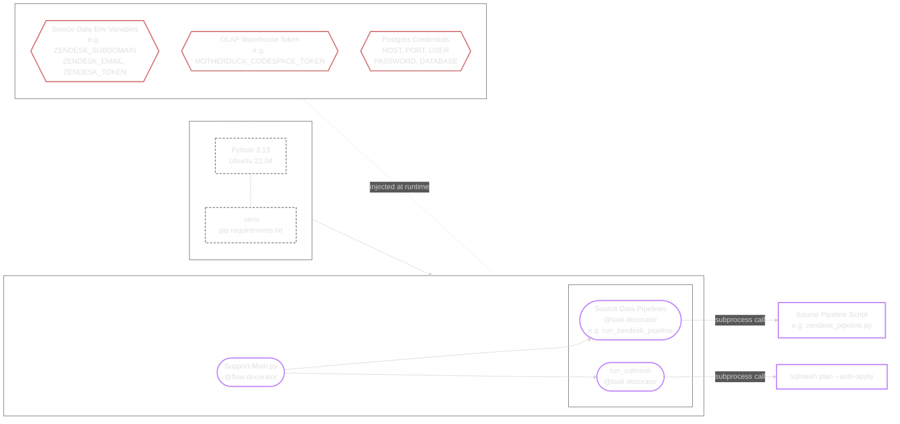
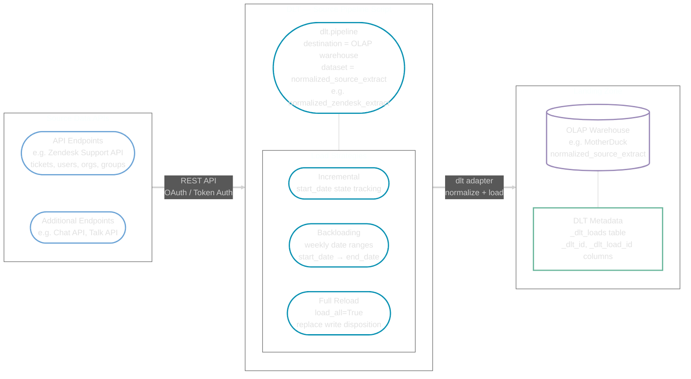
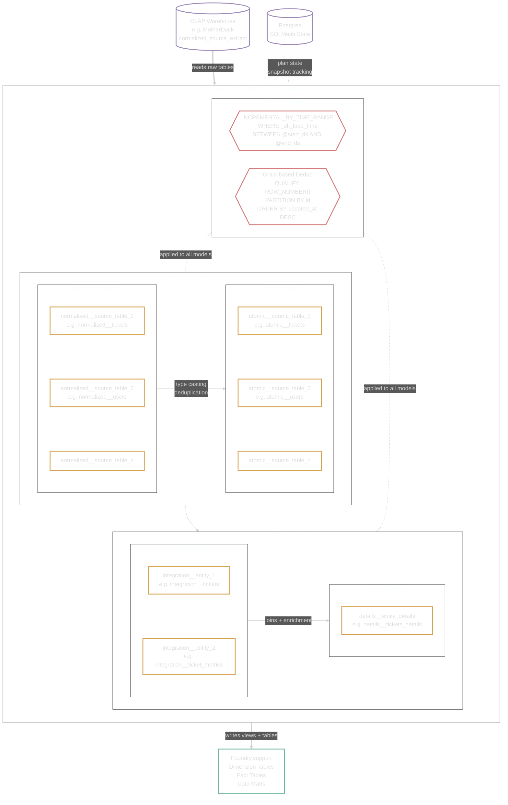
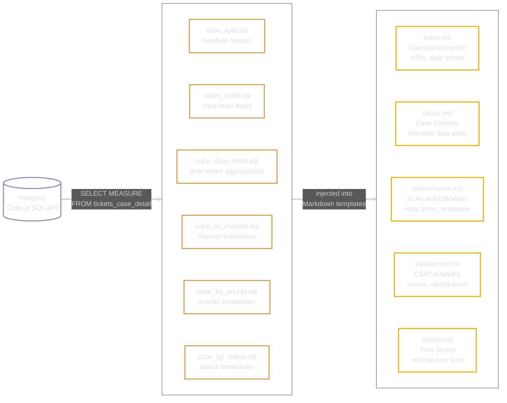
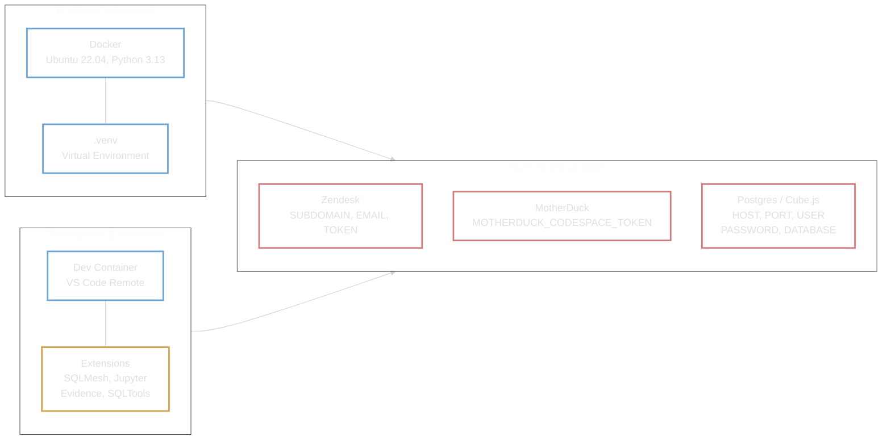
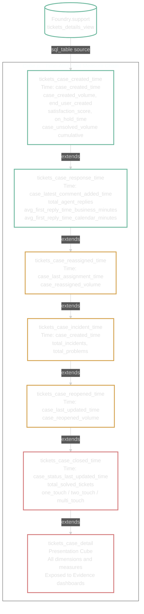
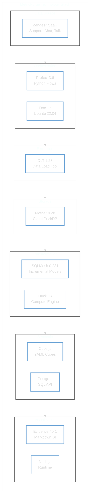

# MetricForge Foundry — System Architecture

## High-Level Overview

```mermaid
%%{init: {'theme': 'dark', 'themeVariables': {'mainBkg': 'transparent', 'nodeBorder': '#555', 'clusterBkg': 'transparent', 'clusterBorder': '#555'}}}%%
flowchart LR
    classDef input fill:none,color:#e0e0e0,stroke:#6ba3d6,stroke-width:2.5px
    classDef process fill:none,color:#e0e0e0,stroke:#d4a24e,stroke-width:2.5px
    classDef data fill:none,color:#e0e0e0,stroke:#6db89e,stroke-width:2.5px
    classDef config fill:none,color:#e0e0e0,stroke:#d4797a,stroke-width:2.5px
    classDef db fill:none,color:#e0e0e0,stroke:#9b8ab8,stroke-width:2.5px
    classDef infra fill:none,color:#e0e0e0,stroke:#888,stroke-width:2px,stroke-dasharray: 5 3
    classDef portal fill:none,color:#e0e0e0,stroke:#c084fc,stroke-width:2.5px

    subgraph LEFT [" "]
        direction TB
        subgraph PORTAL ["MetricForge Customer Portal"]
            direction TB
            CUST1["Customer 1"]:::portal
            CUST2["Customer 2"]:::portal
            PAGE["Onboarding Page"]:::portal
            V1{{"API Secret Vault<br/>Tenant 1"}}:::config
            V2{{"API Secret Vault<br/>Tenant 2"}}:::config
            CUST1 --> PAGE
            CUST2 --> PAGE
            PAGE --> V1
            PAGE --> V2
        end

        subgraph SOURCES ["Data Sources"]
            direction TB
            S1[/"Support Tools<br/>Zendesk, Freshdesk, etc."/]:::input
            S2[/"CRM<br/>Salesforce, HubSpot, etc."/]:::input
            S3[/"Marketing Automation<br/>Marketo, Pardot, etc."/]:::input
            S4[/"Contact Center<br/>Genesys, Five9, etc."/]:::input
            S1 ~~~ S2 ~~~ S3 ~~~ S4
        end

        PORTAL ~~~ SOURCES
    end

    subgraph T1 ["Support Pipelines: Tenant 1"]
        direction LR
        subgraph CTR1 ["Container Image"]
            direction LR
            E1(["DLT Pipeline"]):::process
            M1A["Normalized<br/>Base Tables"]:::data
            Q1B(["SQLMesh<br/>Atomic Queries"]):::process
            PG1[("Postgres<br/>Tenant 1 State")]:::db
            M1B["Dimension Tables"]:::data
            Q1C(["SQLMesh<br/>Atomic Queries"]):::process
            M1C["Fact Tables"]:::data
            Q1D(["SQLMesh Integration<br/>& Detail Queries"]):::process
            DM1["Data Marts"]:::data
            CU1{{"Cube.dev Config"}}:::config
            EV1["Evidence<br/>Dashboard"]:::config

            E1 --> M1A
            M1A --> Q1B --> M1B
            M1A --> Q1C --> M1C
            M1B --> Q1D
            M1C --> Q1D
            Q1D --> DM1
            DM1 --> CU1 --> EV1
            Q1B -.-|state| PG1
            PG1 -.-|state| Q1C
            PG1 -.-|state| Q1D
        end
        MD1[("MotherDuck<br/>Tenant 1 DB")]:::db
        BS1[/"Block Storage<br/>Tenant 1"/]:::infra
        E1 -.-|storage| MD1
        M1A -.-|storage| MD1
        M1B -.-|storage| MD1
        M1C -.-|storage| MD1
        DM1 -.-|storage| MD1
        PG1 -.-|persists to| BS1
    end

    subgraph T2 ["Support Pipelines: Tenant 2"]
        direction LR
        subgraph CTR2 ["Container Image"]
            direction LR
            E2(["DLT Pipeline"]):::process
            M2A["Normalized<br/>Base Tables"]:::data
            Q2B(["SQLMesh<br/>Atomic Queries"]):::process
            PG2[("Postgres<br/>Tenant 2 State")]:::db
            M2B["Dimension Tables"]:::data
            Q2C(["SQLMesh<br/>Atomic Queries"]):::process
            M2C["Fact Tables"]:::data
            Q2D(["SQLMesh Integration<br/>& Detail Queries"]):::process
            DM2["Data Marts"]:::data
            CU2{{"Cube.dev Config"}}:::config
            EV2["Evidence<br/>Dashboard"]:::config

            E2 --> M2A
            M2A --> Q2B --> M2B
            M2A --> Q2C --> M2C
            M2B --> Q2D
            M2C --> Q2D
            Q2D --> DM2
            DM2 --> CU2 --> EV2
            Q2B -.-|state| PG2
            PG2 -.-|state| Q2C
            PG2 -.-|state| Q2D
        end
        MD2[("MotherDuck<br/>Tenant 2 DB")]:::db
        BS2[/"Block Storage<br/>Tenant 2"/]:::infra
        E2 -.-|storage| MD2
        M2A -.-|storage| MD2
        M2B -.-|storage| MD2
        M2C -.-|storage| MD2
        DM2 -.-|storage| MD2
        PG2 -.-|persists to| BS2
    end

    SOURCES --> E1
    SOURCES --> E2
    V1 -.-|API credentials| E1
    V2 -.-|API credentials| E2
```

> | Shape | Meaning |
> |---|---|
> | Parallelogram | External input / data source |
> | Rounded rectangle | Process (DLT Pipeline, SQLMesh Query) |
> | Rectangle | Data output (tables, marts) |
> | Hexagon | Configuration (Cube.dev, Evidence) |
> | Cylinder | Database (MotherDuck, Postgres) |
> | Solid arrow | Data flow |
> | Dotted line | Storage dependency |
>
> Pipelines are duplicated per tenant, each with isolated MotherDuck databases. Postgres is shared for SQLMesh state management.

---

## Step-by-Step Pipeline Details

### Step 1 — Orchestration

### Step 2 — Extraction (DLT)

### Step 3 — Transformation (SQLMesh)

### Step 4 — Semantic Layer (Cube.js)

```mermaid
%%{init: {'theme': 'dark', 'themeVariables': {'mainBkg': 'transparent', 'nodeBorder': '#555', 'clusterBkg': 'transparent', 'clusterBorder': '#555'}}}%%
flowchart LR
    classDef data fill:none,color:#e0e0e0,stroke:#6db89e,stroke-width:2.5px
    classDef semantic fill:none,color:#e0e0e0,stroke:#6db89e,stroke-width:2.5px
    classDef config fill:none,color:#e0e0e0,stroke:#d4797a,stroke-width:2.5px
    classDef db fill:none,color:#e0e0e0,stroke:#9b8ab8,stroke-width:2.5px

    SOURCE[("Foundry.support<br/>tickets_details_view")]:::db

    subgraph CUBEJS ["Cube.js Semantic Layer"]
        direction TB
        subgraph CHAIN ["6-Cube Inheritance Chain"]
            direction TB
            C1["tickets_case_created_time<br/>time: case_created_time<br/>case_created_volume, satisfaction_score<br/>on_hold_time, case_unsolved_volume"]:::semantic
            C2["tickets_case_response_time<br/>time: case_latest_comment_added_time<br/>total_agent_replies<br/>avg_first_reply_time_business_minutes"]:::semantic
            C3["tickets_case_reassigned_time<br/>time: case_last_assignment_time<br/>case_reassigned_volume"]:::semantic
            C4["tickets_case_incident_time<br/>time: case_created_time<br/>total_incidents, total_problems"]:::semantic
            C5["tickets_case_reopened_time<br/>time: case_last_updated_time<br/>case_reopened_volume"]:::semantic
            C6["tickets_case_closed_time<br/>time: case_status_last_updated_time<br/>total_solved_tickets<br/>one_touch / two_touch / multi_touch"]:::semantic
            C1 -->|extends| C2 -->|extends| C3 -->|extends| C4 -->|extends| C5 -->|extends| C6
        end
        C7["tickets_case_detail<br/>Presentation Cube<br/>all dimensions + measures"]:::config
        C6 -->|extends| C7
    end

    PG[("Postgres<br/>Cube.js SQL API<br/>Port 5432")]:::db

    SOURCE ==>|sql_table| C1
    C7 ==>|"exposes via"| PG
```

### Step 5 — Visualization (Evidence)

## Infrastructure and Environment

## Data Lakehouse Layers

```mermaid
%%{init: {'theme': 'dark', 'themeVariables': {'mainBkg': 'transparent', 'nodeBorder': '#555', 'clusterBkg': 'transparent', 'clusterBorder': '#555'}}}%%
flowchart LR
    classDef bronze fill:none,color:#e0e0e0,stroke:#cd7f32,stroke-width:2.5px
    classDef silver fill:none,color:#e0e0e0,stroke:#c0c0c0,stroke-width:2.5px
    classDef gold fill:none,color:#e0e0e0,stroke:#ffd700,stroke-width:2.5px
    classDef vizstyle fill:none,color:#e0e0e0,stroke:#6ba3d6,stroke-width:2.5px

    B["BRONZE<br/>Raw DLT Tables<br/>MotherDuck<br/>normalized_zendesk_extract"]:::bronze
    S["SILVER<br/>Cleaned and Deduped<br/>SQLMesh Models<br/>Foundry.support"]:::silver
    G["GOLD<br/>Semantic Metrics<br/>Cube.js 6-Cube Chain<br/>tickets_case_detail"]:::gold
    V["VISUALIZATION<br/>Evidence Dashboards<br/>5 Pages, 6 SQL Sources<br/>Markdown + Charts"]:::vizstyle

    B ==>|"SQLMesh<br/>incremental macros"| S
    S ==>|"Cube.js<br/>YAML definitions"| G
    G ==>|"Postgres SQL API<br/>MEASURE queries"| V
```

## Semantic Cube Inheritance

## Technology Stack

